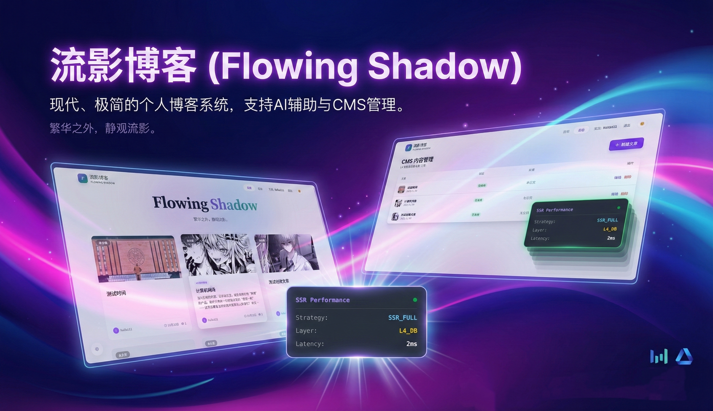

# 流影博客 

基于 React + Express + MySQL 构建的SSR 博客系统，集成 Redis 缓存优化、服务端降级、豆包 AI 写作助手等进阶功能。

## 项目概述

本项目是一个完整的博客内容管理系统，采用服务端渲染（SSR）架构实现首屏快速加载和 SEO 优化。前端使用 React 18 配合 Vite 构建，后端基于 Express 框架，采用 MySQL 数据库，通过 Redis 实现多层缓存策略。系统支持用户认证授权、文章 CRUD 操作、AI 辅助写作、图片上传等核心功能，提供完善的降级保护机制确保高可用性。

## 功能实现详解

### SSR 服务端渲染

服务端渲染是用 Express 服务器结合 Vite SSR 模式实现。当请求到达时，服务器首先从 MySQL 数据库（或 Redis 缓存）获取文章数据，然后调用 React 的 `renderToString` 方法将 App 组件渲染为完整的 HTML 字符串。渲染后的 HTML 会注入预取的数据作为 `window.__INITIAL_DATA__`，客户端激活（hydration）时直接使用该数据避免重复请求。文章列表页和详情页均支持 SSR，搜索引擎爬虫可以直接获取完整内容。开发环境下 Vite 提供热更新支持，生产环境则使用预构建的静态资源，静态文件配置强缓存（maxAge: 1y）以提升加载性能。

### 后端 API 与数据库设计

后端 API 采用 RESTful 设计，使用 Express 框架搭建。数据库MySQL通过 Sequelize ORM 进行模型定义和关系映射。数据库包含五张核心表：users 用户表存储账户信息和角色权限，articles 文章表存储内容和状态（支持 DRAFT/PUBLISHED/ARCHIVED），categories 分类表和 tags 标签表用于内容组织，article_tags 关联表实现文章与标签的多对多关系。文章表设计了 is_deleted 字段支持逻辑删除，published_at 记录发布时间以便按时间排序。所有模型定义了适当的索引（如 status、author_id、published_at）以优化查询性能。API 提供文章列表分页查询（支持按分类、标签、状态筛选）、详情查询、新增、修改和删除（支持逻辑删除和物理删除）等完整 CRUD 功能。

### HTTP 缓存策略

我们的系统实现了完整的 HTTP 缓存策略以提升性能。静态资源（CSS、JS、图片、字体）配置强缓存，通过 Express 的 static 中间件设置 `maxAge: '1y'` 和 `immutable: true`，浏览器在缓存有效期内直接使用本地缓存不发起请求。动态生成的 HTML 页面采用协商缓存，服务器计算响应内容的 ETag 值并在响应头中返回，后续请求携带 If-None-Match 头，若内容未变化则返回 304 状态码节省带宽。API 响应也设置了 X-Cache 头标识数据来源（Redis 缓存命中或数据库查询），便于调试和性能监控。上传的图片文件同样配置长期缓存（1 年），因为文件名包含时间戳保证唯一性，更新时会生成新文件名自动失效旧缓存。

### Redis 缓存优化

Redis 缓存服务使用 ioredis 客户端实现，采用多层缓存架构设计。文章列表和详情数据首先尝试从 Redis 获取（L2 层），未命中时查询 MySQL 数据库（L4 层）并将结果写入缓存。缓存 key 设计考虑了分页参数、筛选条件等因素，如 `articles:list:p1:l10:call:tall:sPUBLISHED` 表示第一页、每页10条、全分类、全标签、已发布状态的文章列表。缓存更新策略采用主动失效模式：文章创建、修改或删除时，通过 `invalidateArticle` 方法删除对应详情缓存，通过 `invalidateArticleList` 方法使用 SCAN 命令模式匹配删除所有列表缓存，确保数据一致性。系统还实现了 Redis 不可用时的降级方案，自动切换到内存 Map 作为备用缓存。

### 服务端降级方案

系统设计了完整的服务端降级保护机制。启动时检测 MySQL 和 Redis 连接状态，连接失败时标记 `dbConnected` 和 `redisConnected` 为 false。SSR 渲染过程中若数据获取失败（数据库宕机、网络异常等），会捕获异常并设置 `degraded: true` 标志，然后返回不包含预取数据的基础 HTML 骨架，由客户端接管数据请求和渲染。客户端通过 `window.__SSR_DEGRADED__` 检测降级状态，在 UI 上显示"系统服务降级中"提示和"刷新重试"按钮。API 接口在数据库不可用时返回 503 状态码和友好错误信息。前端还提供了开发者工具面板，可以模拟 Redis/MySQL 离线状态测试降级行为。

### AI 写作助手

我集成了字节跳动豆包（Doubao）大模型，通过火山引擎 Ark API 调用。编辑器提供六种 AI 辅助功能：智能拟题根据文章内容或关键词生成多个候选标题；摘要提炼自动从正文中提取100字左右的精华概要；续写功能根据上下文语境继续撰写段落；润色功能优化行文逻辑和表达方式；标签大纲功能根据用户输入的标签生成文章结构框架；SEO 诊断功能分析内容并给出搜索优化建议。前端将请求发送到 `/api/ai/generate` 接口，携带类型、提示词、上下文等参数，服务端构建系统提示词和用户提示词后调用豆包 API，返回 Markdown 格式的生成内容。未配置 API Key 时接口返回模拟数据以便开发调试。AI 接口配置了独立的限流策略（每分钟10次）保护 API 配额。

### 用户认证与权限控制

用户认证基于 JWT（JSON Web Token）实现，密码使用 bcrypt 进行加盐哈希存储（12轮）。用户注册时验证用户名和邮箱唯一性，创建用户后生成 JWT 令牌返回客户端。登录时支持用户名或邮箱登录，验证密码后签发有效期7天的令牌，令牌包含用户 ID、用户名、角色等信息。客户端将令牌存储在 localStorage，后续请求通过 Authorization Bearer 头携带。系统定义了三种角色：admin 管理员拥有全部权限，editor 编辑可管理文章，user 普通用户只能管理自己的内容。`authenticate` 中间件验证令牌有效性并将用户信息注入 req.user，`authorize` 中间件检查角色权限，`checkOwnership` 中间件验证资源所有权（管理员可绕过）。前端通过 AuthContext 管理认证状态，未登录用户访问后台时弹出登录模态框。

### 接口限流防刷

接口限流通过自定义中间件实现，支持 Redis 和内存两种存储模式。限流器采用固定时间窗口算法，记录每个 IP 在时间窗口内的请求次数，超过阈值返回 429 状态码和 Retry-After 头。系统预配置了多种限流策略：通用 API 限流每分钟100次请求；认证接口（登录注册）每15分钟10次防暴力破解；文件上传每小时20次；AI 接口每分钟10次保护配额。限流 key 设计为 `ratelimit:{ip}:{path}`，不同路径独立计数。响应头包含 X-RateLimit-Limit（限制次数）、X-RateLimit-Remaining（剩余次数）、X-RateLimit-Reset（重置时间戳）便于客户端处理。限流状态优先存储在 Redis，Redis 不可用时降级到内存 Map，定时清理过期记录防止内存泄漏。

### 文件上传功能

图片上传功能使用 multer 中间件处理 multipart/form-data 请求。上传接口 `/api/upload/cover` 接收封面图片文件，配置了文件类型过滤（只允许 image/* MIME 类型）和大小限制（最大5MB）。文件存储在服务器 uploads 目录，文件名格式为 `cover-{时间戳}-{随机数}.{扩展名}` 确保唯一性。上传成功返回文件的访问 URL（如 `/uploads/cover-xxx.jpg`），前端编辑器将其设置为文章封面。uploads 目录配置为静态资源目录，设置强缓存策略。编辑器支持点击上传和 URL 输入两种方式设置封面，上传区域显示实时预览，支持一键清除已选图片。上传接口配置了独立限流（每小时20次）防止存储滥用。

### 前端交互功能

前端使用 React 18 构建，采用函数组件和 Hooks 管理状态。主要交互包括：文章列表展示三列卡片布局，点击卡片进入详情页，支持按分类和标签筛选；详情页显示完整文章内容、作者信息、阅读量统计，支持上下篇导航和沉浸阅读模式，阅读进度自动保存到 localStorage；后台管理支持文章新建、编辑、删除操作，表格展示所有文章状态。Markdown 查看器增强支持代码块（带语言标注）、表格、引用、列表等格式，图片配置懒加载优化性能。暗黑模式切换使用 CSS 类名控制，状态持久化到 localStorage。系统仿真控制台可模拟 Redis/MySQL 离线、不同用户类型（爬虫/快速网络/慢速网络）测试降级和混合渲染策略。


## 环境要求

Node.js 18 或更高版本、MySQL 8.0 或更高版本、Redis 6.0 或更高版本（可选，不配置时自动降级到内存缓存）。

## 安装部署步骤

## Docker 一键部署

作者提供 docker-compose.yml 配置文件，可以一键启动 MySQL 和 Redis 服务，无需本地安装这些服务。我们打开dockerDesktop后，再执行 docker-compose up -d 命令后会创建并启动三个容器：MySQL 监听 3306 端口、Redis 监听 6379 端口、phpMyAdmin 数据库管理界面监听 8080 端口。容器数据通过 Docker Volume 持久化，这样重启也不会丢失。

1. **确保 Docker Desktop 运行**
   ```bash
   # Windows: 启动 Docker Desktop
   # 或者在系统托盘中找到 Docker Desktop 图标并启动
   ```

2. **启动服务**
   ```bash
   cd homework3
   docker-compose up -d
   ```

3. **等待服务启动完成**
   ```bash
   # 检查容器状态
   docker ps
   ```

4. **初始化数据库**
   ```bash
   npm run db:migrate
   ```

5. **启动应用**
   ```bash
   npm run dev
   ```

启动后访问：
- **博客应用**: http://localhost:3000
- **phpMyAdmin**: http://localhost:8080 (用户名: root, 密码: root123)
- **Redis Commander**: http://localhost:8081

### 停止服务

```bash
docker-compose down
```
### 清理数据

```bash
docker-compose down -v
```

如果你不想使用docker，作者也提供了手动安装配置教程：

### 第一步：克隆项目并安装依赖

首先克隆代码仓库到本地，进入项目目录后执行 npm install 安装所有前端和后端依赖包，包括 React、Express、Sequelize、ioredis 等核心依赖。

```bash
git clone <repository-url>
cd homework3
npm install
```

### 第二步：配置环境变量

复制环境变量模板文件 .env.example 为 .env.local，然后使用编辑器打开该文件填写实际的配置信息。数据库配置包括 MySQL 的主机地址、端口、数据库名、用户名和密码；Redis 配置包括主机地址、端口和可选的密码；JWT_SECRET 是用于签发认证令牌的密钥，生产环境必须设置为复杂随机字符串；豆包 AI 配置需要填入火山引擎 Ark 平台的 API Key 和模型端点 ID，如果不使用 AI 功能可以留空。

```bash
cp .env.example .env.local
```

编辑 `.env.local` 文件示例：

```env
# 数据库配置
DB_HOST=localhost
DB_PORT=3306
DB_NAME=ssr_blog
DB_USER=root
DB_PASSWORD=your_mysql_password

# Redis 配置（可选，不配置则使用内存缓存）
REDIS_HOST=localhost
REDIS_PORT=6379
REDIS_PASSWORD=

# JWT 认证密钥（生产环境必须修改为安全的随机字符串）
JWT_SECRET=your-secure-secret-key-change-in-production

# 豆包 AI 配置（可选）
ARK_API_KEY=your-volcengine-ark-api-key
ARK_MODEL_ENDPOINT=your-model-endpoint-id
```

### 第三步：初始化数据库

确保 MySQL 服务已启动运行，首先创建名为 ssr_blog 的数据库并设置 utf8mb4 字符集支持完整的 Unicode 字符。然后执行数据库迁移命令，脚本会自动创建 users、articles、categories、tags、article_tags 五张表，建立外键关系和索引，插入默认的分类和标签数据，以及创建管理员账户（用户名 admin，密码 admin123）。

```bash
# 在 MySQL 命令行中创建数据库
mysql -u root -p -e "CREATE DATABASE ssr_blog CHARACTER SET utf8mb4 COLLATE utf8mb4_unicode_ci;"

# 运行迁移脚本创建表结构和初始数据
npm run db:migrate
```

### 第四步：启动开发服务器

执行开发启动命令后，Vite 会启动开发服务器并启用热模块替换（HMR），Express 服务器在 3000 端口监听请求并处理 SSR 渲染。打开浏览器访问 http://localhost:3000 即可看到博客首页。开发模式下修改代码会自动刷新页面，方便调试。

```bash
npm run dev
```

### 第五步：生产环境部署

生产部署需要先执行构建命令，Vite 会编译并打包前端资源到 dist/client 目录，同时生成服务端渲染入口到 dist/server 目录。构建完成后启动生产服务器，Express 会加载预构建的资源并启用各项性能优化（如静态资源强缓存、gzip 压缩等）。Windows 系统使用 start:win 命令启动。

```bash
# 构建前端和服务端代码
npm run build

# Linux/macOS 启动生产服务器
npm start

# Windows 启动生产服务器
npm run start:win
```


## 项目结构说明

```
homework3/
├── server.js                 # Express 服务器入口，SSR 渲染和 API 路由
├── entry-server.tsx          # React 服务端渲染入口
├── entry-client.tsx          # React 客户端激活入口
├── App.tsx                   # 主应用组件，路由和状态管理
├── index.html                # HTML 模板
├── vite.config.ts            # Vite 构建配置
├── components/               # React 组件目录
│   ├── ArticleCard.tsx       # 文章卡片展示组件
│   ├── ArticleViewer.tsx     # 文章详情阅读组件
│   ├── Editor.tsx            # 文章编辑器（含 AI 功能）
│   ├── Layout.tsx            # 页面布局组件
│   ├── AuthModal.tsx         # 登录注册模态框
│   └── MarkdownViewer.tsx    # Markdown 渲染组件
├── contexts/
│   └── AuthContext.tsx       # 用户认证状态上下文
├── services/
│   ├── backendSimulation.ts  # 前端 API 调用封装
│   └── doubaoService.ts      # 豆包 AI 服务调用
├── server/                   # 后端模块目录
│   ├── config/
│   │   ├── database.js       # MySQL 连接配置
│   │   └── redis.js          # Redis 连接配置
│   ├── models/
│   │   └── index.js          # Sequelize 模型定义
│   ├── services/
│   │   ├── articleService.js # 文章业务逻辑
│   │   ├── authService.js    # 认证业务逻辑
│   │   └── cacheService.js   # 缓存服务层
│   └── middleware/
│       ├── auth.js           # 认证授权中间件
│       └── rateLimiter.js    # 接口限流中间件
├── scripts/
│   └── migrate.js            # 数据库迁移脚本
└── uploads/                  # 文件上传存储目录
```

## API 接口清单

### 用户认证接口

| 方法 | 路径 | 描述 | 限流策略 |
|------|------|------|----------|
| POST | /api/auth/register | 用户注册 | 15分钟10次 |
| POST | /api/auth/login | 用户登录 | 15分钟10次 |
| GET | /api/auth/me | 获取当前用户信息 | 需要认证 |
| PUT | /api/auth/me | 更新用户信息 | 需要认证 |

### 文章管理接口

| 方法 | 路径 | 描述 | 权限要求 |
|------|------|------|----------|
| GET | /api/articles | 获取文章列表（分页、筛选） | 公开访问 |
| GET | /api/articles/:id | 获取文章详情 | 公开访问 |
| POST | /api/articles | 创建新文章 | 需要登录 |
| PUT | /api/articles/:id | 更新文章 | 作者或管理员 |
| DELETE | /api/articles/:id | 删除文章 | 作者或管理员 |
| GET | /api/my/articles | 获取我的文章列表 | 需要登录 |

### 文件与 AI 接口

| 方法 | 路径 | 描述 | 限流策略 |
|------|------|------|----------|
| POST | /api/upload/cover | 上传文章封面图 | 每小时20次 |
| POST | /api/ai/generate | AI 内容生成 | 每分钟10次 |
| GET | /api/health | 服务健康检查 | 无限制 |


## 许可证

MIT License
